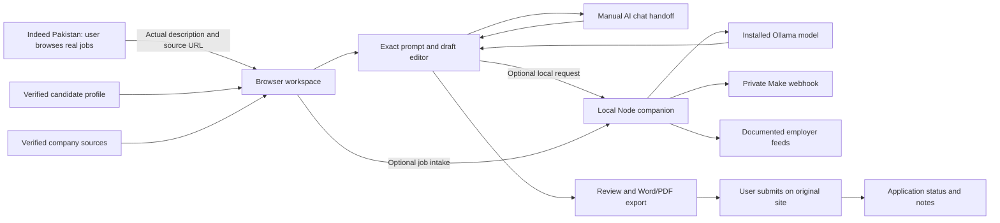

# AI Job Assistant Automation

**Applydesk** is a personal workbench for real job applications, built around Indeed Pakistan searches, verified candidate facts, a preserved resume-writing preset and optional Make automation.

It is not a job board. It starts empty and does not display invented vacancies. It does not claim to scrape Indeed, connect to an Indeed account, or submit applications automatically.

**Live personal edition:** https://ai-job-assistant-automation.vercel.app

## What works

- Add, edit, pause and remove persistent search titles, locations and discovery radii; customize acceptance rules.
- Open focused Indeed Pakistan searches for DevOps, cloud and AI/ML roles in Islamabad, Rawalpindi and remote work.
- Save real descriptions and source URLs; merge duplicate imports without losing application progress.
- Rank with visible reasons and separate location/experience eligibility.
- Save one verified candidate profile and company research notes; read current public company-page text through a bounded HTTPS reader.
- Choose a saved job in Documents, then open company research, resume or optional cover letter.
- Save employer feeds and opt into matching-job collection on opening the app and hourly while it stays open.
- Build a generation prompt containing the **entire original master prompt**, unchanged and checksum-verified.
- Use a separate cover-letter prompt with simple English and no em dashes.
- Paste/edit drafts, validate structural rules and save versions with profile/research snapshots.
- Use a full-resume wrapper with an explicit second-page break and overflow guidance, or keep the exact original three sections.
- Download genuine Word `.docx` and Markdown; print or Save as PDF with consistent 10/11 pt formatting.
- Track statuses, notes and research; export/restore a private workspace backup.
- Optionally call local Ollama, approved employer feeds, or a private Make webhook through the local server.

## Important implementation status

The hosted app runs its core workflow in each visitor's browser. AI drafting requires the manual prompt handoff or an explicitly configured local model. The public deployment does not include a paid AI key, a hosted local model, cross-device accounts, unattended research, or collection while the browser is closed. Data is stored in this browser, not a shared cloud database.

The official Make connection is verified. Scenario **Applydesk · real job intake** (7386585) is active. Its webhook, JSON transformation and response passed an actual job round trip through the local adapter. One run consumed 3 credits. It transports supplied listings; discovery, validation, matching, deduplication and browser persistence are handled by the app. See [Make setup](docs/MAKE-SETUP.md).

## Run locally

Install Node.js 22 or later, clone this repository and run:

```powershell
npm start
```

Open `http://127.0.0.1:4173`. No package installation is required; the app has no runtime package dependencies.

For optional local adapters, copy `.env.example` to `.env`, set only the values you need, and run:

```powershell
node --env-file=.env server.mjs
```

`OLLAMA_MODEL` must name an already installed local model. `MAKE_WEBHOOK_URL` must be the actual private regional Make webhook URL. Keep both out of public source. No paid fallback is enabled. The local server must be running and your computer awake for these adapters to work.

## First real application

1. Open **My profile** and enter truthful skills, work history and education. No resume upload is necessary.
2. Open **Search planner**, launch a real Indeed Pakistan search and verify its location, distance and freshness filters.
3. Open **Save a job** and add the actual description and original URL.
4. Review its eligibility and company research. Save verified official source notes.
5. Open **Tailored resume**, copy the complete prompt, use your own AI chat with browsing and paste the finished sections back. Or configure local Ollama.
6. Fix structural warnings, review every claim, and export Word or PDF. Cover letters have a separate tab.
7. Apply on the original site yourself, then update the status. Merely opening a listing never marks it Applied.

## Documentation

- [Full research and product plan](docs/PRODUCT-PLAN.md)
- [First Make scenario and integration contract](docs/MAKE-SETUP.md)
- [User guide and limitations](docs/USER-GUIDE.md)
- [Verification and release status](docs/VERIFICATION.md)
- [Unmodified master prompt](dist/prompts/master-resume.txt)

## Verify

```powershell
npm run check
npm test
```

Checks cover JavaScript syntax, required assets and the master-prompt hash. Tests cover duplicates, eligibility, source recency, prompt separation, formatting, malicious text, Word packaging and local endpoint protection. Test fixtures are internal test data, not public vacancy listings.

## Deploy

Vercel configuration is included. Use framework **Other**, output folder `dist`, build command `npm run check`. The frontend is static, with `/api/service` providing public research/feed adapters on Vercel. The private Make/Ollama routes in `server.mjs` remain local. Netlify can host the static workspace using the included `netlify.toml`.

Before turning the project into a commercial service, reassess hosting terms and implement accounts, tenant isolation, durable storage, background jobs and per-user cost limits. Do not expose the personal local server as a multi-user service.

## Architecture



No subscriptions were purchased for this implementation. Zero provider spend does not mean unlimited model usage, guaranteed uptime or free computer resources. See the plan for researched limits and tradeoffs.

## Hosting adapters

The Vercel deployment includes `/api/service` for public Greenhouse/Lever feeds and user-requested company-page reading. These endpoints have no paid model or Make credentials. The Netlify configuration hosts the static workspace only; use the local companion for adapters there. Free hosting limits still apply.

`npm start` reads an optional private `.env` file. The project owner’s local Make setting was configured during setup; clones and public visitors need their own webhook. Never copy `.env` into GitHub or `dist`.
