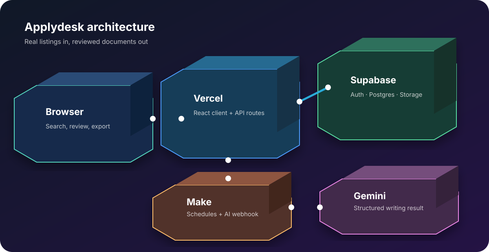

# Applydesk · AI Job Assistant Automation

Applydesk is a practical, privacy-first job application workspace. It helps a candidate save career facts once, discover real opportunities, compare each role with preferences, and prepare a tailored resume or cover letter. It is a workbench, not a fictional job board: every listing keeps its source link and the final application stays under the candidate's control.

**Live app:** [ai-job-assistant-automation.vercel.app](https://ai-job-assistant-automation.vercel.app/)



## Why this project exists

Job hunting repeats the same work: search several titles and locations, copy a description, rewrite a resume, format a document, and track applications. Paid tools often hide this workflow behind subscriptions. Applydesk brings the useful parts into one free-tier-friendly project while keeping candidate facts private and source websites visible.

## What a user can do

1. Create search profiles with multiple titles, locations, radius and remote preference.
2. Discover real remote listings from the configured public feed and open official Indeed Pakistan searches in a new tab.
3. Save, deduplicate, edit or remove one job, or remove all saved jobs.
4. See transparent match reasons, missing requirements and location/experience checks.
5. Upload a PDF, Word document or text resume. The parser extracts text and maps safe fields into the profile for review.
6. Select a saved job and generate a job-specific resume or optional cover letter using the preserved master prompt and company research.
7. Edit the draft, validate writing rules, save versions, and download a real `.docx` or Markdown file (or print to PDF).
8. Track application status, notes and research, and export or restore a private workspace backup.

## Boundaries that keep the workflow real

The app does not invent vacancies, scrape Indeed behind a login, store Indeed credentials, or submit applications unattended. **View original & apply** opens the official Indeed URL so the user can sign in and complete the application themselves. Automatic collection uses approved public feeds; Make can run the collector in the background, but it never receives an Indeed password.

## Architecture

The browser is the main workspace. Supabase Auth protects user data and Storage keeps uploads private. Vercel serves the web app and API routes. Make provides optional orchestration: a scheduled worker asks the Supabase edge function to collect listings, while a separate webhook sends a structured writing prompt to Gemini and returns JSON. The client validates, stores and renders the result.

```text
Browser → Vercel client/API → Supabase Auth + Postgres + Storage
                    │                 └→ Edge worker → public job feeds
                    └→ Make webhook → Gemini → validated resume/letter JSON
```

See the [3D architecture diagram](docs/architecture-3d.svg), [Make guide](docs/MAKE-SETUP.md), and [verification runbook](docs/VERIFICATION.md).

## Technology

- Vite, React and modern JavaScript for the responsive single-page interface.
- Supabase Auth, Postgres, Row Level Security and private Storage.
- Vercel for the production build and serverless API surface.
- Make for scheduled discovery and AI-writing orchestration.
- Google Gemini through Make, with local Ollama as an optional development fallback.
- `pdfjs-dist` for workerless server-side PDF extraction, `mammoth` for `.docx`, and `docx` for export.
- Vitest plus project check/build scripts for regression coverage.

## Repository map

Each major folder has its own beginner guide:

| Folder | Purpose |
| --- | --- |
| [`client/`](client/README.md) | UI, routes, state, forms and document screens |
| [`api/`](api/README.md) | Vercel HTTP handlers and safe server-side adapters |
| [`lib/`](lib/README.md) | Parsing, matching, prompts, validation and persistence helpers |
| [`supabase/`](supabase/README.md) | Edge worker, migrations and database integration |
| [`scripts/`](scripts/README.md) | Local checks and operational helpers |
| [`tests/`](tests/README.md) | Unit and workflow tests |
| [`docs/`](docs/README.md) | Product, architecture, Make and release documentation |
| [`dist/`](dist/README.md) | Versioned prompt and distribution assets |

## Run it locally

```bash
npm ci
npm run build
npm run check
npm test
npm start
```

Copy `.env.example` to `.env.local` and add only values for services you enabled. The important production setting is `MAKE_AI_WEBHOOK_URL`; never commit webhook URLs, Supabase service keys, model keys or worker keys. Supabase redirect URLs must include local and Vercel origins. For internal testing, create or auto-confirm a user in Supabase Authentication before signing in.

## Make integration

The project uses two small scenarios. **Applydesk · real job intake** receives approved listing data and returns a normalized response. **Applydesk · background discovery** runs on a schedule and calls the Supabase worker with a private hashed key. The writing scenario receives `{ prompt, job, profile, research }`, calls Gemini, and returns strict JSON containing document text and metadata. The application still performs matching, deduplication, rule validation and persistence. Full module configuration, connection setup and troubleshooting are in [`docs/MAKE-SETUP.md`](docs/MAKE-SETUP.md).

## Prompt and document quality

The original master prompt is preserved byte-for-byte at [`dist/prompts/master-resume.txt`](dist/prompts/master-resume.txt) and verified by [`docs/master-prompt.sha256`](docs/master-prompt.sha256). Generated drafts are checked for placeholders, forbidden em dashes, section rules and bullet format before export. A second-page resume wrapper is available, but no tool can honestly promise a 100% ATS score or a job offer; the candidate reviews every fact before applying.

## Deployment

The `main` branch is linked to Vercel and the GitHub repository. A normal push builds and deploys the app. Configure Supabase and Make secrets in Vercel Environment Variables, then verify the production origin, auth redirect and API health. The deployment guide and release checklist are in [`docs/RELEASE-0.3.md`](docs/RELEASE-0.3.md).

## Roadmap

Next improvements are provider-agnostic email delivery, richer approved feeds, background notifications, stronger observability and optional paid team plans. The core privacy model and user-controlled Indeed handoff should remain unchanged.

## License and responsible use

This repository is a personal software-house project. Use it only with accounts and data you are authorized to use, follow each job site's terms, and review generated documents before sending them.
