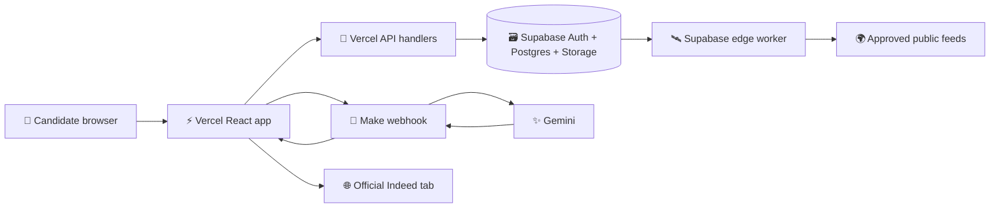

# 🧭 Applydesk beginner handbook

This is the complete, plain-language guide to how Applydesk works from the first browser click to a reviewed application document. It is written for someone who can follow steps but is still learning React, APIs, databases, authentication and automation.

## 🌟 Read this first: the whole project in simple words

Imagine a helpful desk with five drawers. You put your career information in the first drawer once. You tell the desk what jobs and places you want in the second drawer. The desk checks approved public job sources and places useful real listings in the third drawer. You choose one listing in the fourth drawer and the desk prepares a resume or letter using your confirmed facts. The fifth drawer remembers what you reviewed or applied to.

The website is the front door. React draws the screens and buttons. Vercel delivers those screens and receives secure requests. Supabase is the locked filing cabinet: it confirms who you are and stores your profile, jobs and documents. Make is the messenger and clock: it can wake up on a schedule, call the job collector, and carry one writing request from the website to Gemini. Gemini is the drafting assistant. The application checks the draft and you approve it.

Make is not a second website and it is not the database. It is useful because a visual automation can run repeated work without a person keeping a browser tab open. It also lets the project change AI providers later without rewriting the whole website. If Make is switched off, saved work remains available; scheduled discovery and hosted AI writing wait until the connection returns.

### The one complete example

You save “DevOps Intern” and “Islamabad” as preferences. Every six hours, Make asks the Supabase worker to check the approved public feed. The worker returns real listings, the app checks location and skills, and new records are saved. You open a listing and press **Create tailored resume**. The browser sends the job plus your verified profile to Make. Make passes that request to Gemini, receives structured text and returns it. The app checks the rules, shows the draft and lets you download Word. You then open the official Indeed link and apply yourself.


## 0. The idea in one minute

Applydesk saves a candidate's facts once. It searches approved public job sources, keeps the original link, explains why a role may fit, and prepares a resume or cover letter for that specific job. The candidate reviews every fact and uses the official Indeed page to apply. The system never invents a vacancy, asks for an Indeed password or submits an authenticated application in the background.

Think of the product as five connected rooms:

| 🎯 Room | What happens there |
| --- | --- |
| **Your story** | Upload and confirm the facts that describe you |
| **Job search** | Save titles, cities, radius and remote preferences |
| **Matches** | Import real listings, rank them and save the useful ones |
| **Documents** | Generate, edit, validate and download a job-specific document |
| **Application tracking** | Open the original source, record status and keep notes |

## 1. The big picture: who talks to whom



### Why there are separate parts

- **Browser/client:** shows screens, collects clicks and renders results.
- **Vercel/API:** provides a controlled server boundary for uploads and AI requests.
- **Supabase:** authenticates people and stores private, durable records.
- **Edge worker:** performs scheduled feed collection away from the browser.
- **Make:** connects the worker and AI provider using visual modules.
- **Gemini/Ollama:** drafts language from supplied facts; it is never the source of truth.
- **Indeed:** remains an external website where the person performs the final application.

Keeping these responsibilities separate means a failed AI call cannot erase a job, and an empty feed cannot become an invented listing.

## 2. Before you start 🧰

You need Node.js, a Supabase project, a Make account and (optionally) a Gemini connection. The free tiers are enough for internal testing with small volumes. Use test data while developing.

```bash
npm ci                 # install the exact locked dependencies
Copy-Item .env.example .env.local
npm run build          # create the production bundle
npm run check          # syntax, required assets and prompt checksum
npm test               # regression suite
npm start              # serve the built app locally
```

Open the local URL printed by the last command. In Supabase Authentication → URL Configuration, add both the local URL and `https://ai-job-assistant-automation.vercel.app`. Create or auto-confirm one test user under Authentication → Users. Do not place a service-role key, worker secret, Gemini key or Make webhook URL in Git.

## 3. Step-by-step user flow 👣

### Step 1 — Sign in

The client asks Supabase Auth for an email/password session. Supabase returns a short-lived access token and refresh token. The client stores the session using the Supabase SDK and attaches the access token to API requests. Database policies then know which `auth.uid()` owns a row. If confirmation email delivery is disabled or rate-limited, create an auto-confirmed internal user in the Supabase dashboard rather than hard-coding credentials in the app.

### Step 2 — Build **Your story**

The profile screen has fields for name, contact links, location, field, skills, experience and preferences. You can type them manually or upload a file.

#### What happens during upload

1. The browser sends the file to the upload API with the active access token.
2. The API checks the size and MIME type. Word archives are expanded defensively so a zip bomb cannot exhaust the server.
3. For PDF, `pdfjs-dist/legacy/build/pdf.mjs` reads pages with `disableWorker: true`; this avoids the serverless worker-file error. Cleanup checks whether `destroy()` exists before calling it.
4. For `.docx`, `mammoth` extracts readable paragraphs. Plain text is read directly.
5. The parser normalizes whitespace and searches conservative patterns for email, phone, URLs, headings, skills and experience.
6. Suggestions are returned to the client. “Resume read” means text extraction succeeded; it does not mean every field was guessed safely.
7. You review and correct suggestions. Only after saving does the profile become the verified fact source for writing.

If a name or skill is absent, that field stays empty rather than being invented. Clear headings such as `Skills`, `Experience` and `Education` improve suggestions.

### Step 3 — Define a repeatable search 🔎

In **Job search**, add any number of titles, locations and radii. For example, use DevOps Intern, Cloud Intern and AI Engineer Intern, then Islamabad, Rawalpindi and Remote. Choose whether remote work is allowed and add custom rules for job families or cities. The client validates empty titles and saves the search preferences in a user-owned record.

### Step 4 — Discover and understand listings 🌍

When discovery runs, the API or edge worker calls only allow-listed public feed destinations. The adapter converts each source shape into one internal shape: title, company, location, description, source URL, posted date, updated date and source evidence. Normalization rejects script URLs and off-source application links. A stable job key prevents duplicates.

The matcher compares the normalized listing with the saved preferences. It separately checks location eligibility, remote wording, experience level and skill overlap. The score is accompanied by strengths and “things to check,” so a transferable role remains visible for human review instead of disappearing below an arbitrary threshold.

### Step 5 — Browse Indeed safely 🇵🇰

Click **Browse Indeed with my preferences** to open a new official Indeed Pakistan tab. The app builds a focused search URL from your saved title and location. You sign in to Indeed in that tab and browse or apply manually. Applydesk does not inject scripts into the authenticated site, store cookies, scrape private results or press an Apply button. This is deliberate account safety and keeps the source link verifiable.

### Step 6 — Save and manage jobs 💾

Saving a card writes the normalized job and its match explanation to Supabase. The saved page supports editing notes/status, opening the source, deleting one job and **Remove all saved jobs** with a confirmation. Application status is your own record: discovered, reviewing, ready, applied, interview or closed.

### Step 7 — Research the company 🏢

The company reader accepts bounded public HTTPS pages and blocks private/reserved network destinations. It stores a short, dated research note with its URL. Research is context for a draft, never a replacement for the job description or your verified facts.

### Step 8 — Create a tailored resume or cover letter ✍️

From a saved job, choose **Create tailored resume** or **Create cover letter**. The client assembles a request containing:

```json
{
  "prompt": "the unchanged master prompt plus job-specific instructions",
  "job": "normalized saved listing",
  "profile": "verified candidate facts",
  "research": "recent bounded company notes"
}
```

The full original prompt is preserved at `dist/prompts/master-resume.txt` and checked by `docs/master-prompt.sha256`. The cover-letter prompt is separate so resume structure rules do not leak into a letter.

### Step 9 — How Make writes the draft 🔁

1. Vercel posts the JSON request to the private `MAKE_AI_WEBHOOK_URL`.
2. Make's webhook receives the request and passes `prompt` into the Gemini module.
3. Gemini drafts only from the supplied job, profile and research context.
4. Make maps the model candidate text into the response JSON contract.
5. Vercel returns the result to the browser.
6. The client validates it before showing Save or Download as complete.

If the webhook is offline, the saved job and profile remain safe. Local development may use Ollama as an alternative adapter.

### Step 10 — Validate, edit and export ✅

Validators reject unresolved placeholders, em dashes, unsupported years, invented sections and malformed experience bullets. The resume preset expects one to five experience bullets beginning with `▸`; the cover letter uses simple, natural English. You can edit the draft, save versions with profile/job snapshots, download Word or Markdown, and print the preview to PDF. Review every claim before sending it.

## 4. Make automation: complete setup 🛠️

### Why Make is used

Without Make, the browser must stay open for repeated work and the website needs custom code for every AI provider and schedule. Make provides visible boxes with scheduling, service connections, field mapping and execution history. A beginner can inspect each handoff. Make moves messages between services; the application remains responsible for truth, privacy, matching and document quality.

| Job | Starts when | Make does | The application does |
| --- | --- | --- | --- |
| 🔎 Background discovery | Six-hour schedule | Calls the Supabase worker with a private key | Validates feeds, matches, deduplicates and stores jobs |
| ✨ AI writing | Documents button | Sends the structured prompt to Gemini and maps JSON | Supplies verified facts, validates and saves the draft |

### Background discovery, step by step

1. Make's scheduler wakes up, so no browser tab is required.
2. Its HTTP module calls the Supabase `job-worker` endpoint with the protected worker key.
3. The edge function checks the key, calls allow-listed public feeds and receives source records.
4. The worker normalizes each record into the common job shape.
5. Supabase stores new jobs; a stable key prevents duplicates.
6. The worker returns counts and errors, and Make records the execution.
7. When the user opens Job search, the client reads the newest owner-scoped jobs and calculates match explanations.

### AI writing, step by step

1. The user selects a saved job and clicks resume or cover letter.
2. The client combines the job, confirmed profile, research and preserved master prompt.
3. Vercel posts one JSON request to the private `MAKE_AI_WEBHOOK_URL`.
4. Make maps the `prompt` field into Gemini contents.
5. Gemini drafts only from the supplied context.
6. Make maps the model candidate into the response JSON contract and returns it.
7. The client rejects placeholders, unsupported claims, em dashes and wrong structure.
8. The user edits, confirms, saves and downloads the document.

### How to prove Make is connected

Run the discovery scenario once manually and confirm a worker response. Then create one document from a saved job and confirm a successful webhook execution, valid JSON and a draft in the browser. If a test fails, check the connection, URL, request body and response mapping in that order. Never put a secret in a screenshot or GitHub.

### Scenario A — Background discovery

1. Deploy the `supabase/functions/job-worker` edge function.
2. Set its private worker secret in Supabase.
3. In Make, add a Scheduler module (the internal default is every six hours).
4. Add an HTTP request module pointing at the worker URL.
5. Send the hashed worker key and the allowed search configuration.
6. Map the worker response to a success/error branch.
7. Activate the scenario and run it once manually.
8. Confirm the execution writes normalized jobs and preserves source dates.

### Scenario B — AI writing webhook

1. Add a **Custom webhook** module and copy its URL.
2. Store that URL in Vercel as `MAKE_AI_WEBHOOK_URL` for the correct environment.
3. Add the official Gemini connection and choose the configured flash model.
4. Map the incoming `prompt` to Gemini contents.
5. Keep the response mapping strict JSON and map the candidate text into the expected document fields.
6. Send one test request from Documents and inspect Make execution history.
7. Activate the scenario only after the response shape passes the client validator.

Make is the visual transport and scheduler. Matching, deduplication, validation and persistence stay in the application so the behavior remains testable and portable.

## 5. Database and security 🗃️

Supabase Postgres stores profiles, searches, jobs, documents, research and statuses. Each table has an owner relationship. Row Level Security policies compare that owner with `auth.uid()`, meaning a user cannot read another user's row even if they manually change a request. Private Storage keeps original uploads behind the same session. Public environment values identify the project; privileged keys remain server-side.

## 6. API map 🔌

The Vercel handlers are intentionally small: authenticated profile/job persistence, safe upload parsing, bounded company reading, health responses and Make writing requests. Shared functions in `lib/` contain matching, normalization, prompt assembly, validation and DOCX export. This makes the rules run identically in the browser flow and automated tests.

## 7. Deployment 🚀

The GitHub `main` branch is connected to Vercel. A push triggers install, build and production deployment. Configure Supabase URL/key, `MAKE_AI_WEBHOOK_URL`, worker settings and any optional model variables in Vercel Environment Variables. After deployment, verify the auth redirect, one upload, one public listing, one saved job and one document download from the production URL.

## 8. Troubleshooting 🧯

- **Blank page:** run the production build and inspect the browser console; confirm Vercel deployed the same Git commit.
- **Email rate limit:** wait for the provider window or use one auto-confirmed internal test account.
- **PDF worker error:** reinstall dependencies and redeploy; the parser is configured workerless and the Vercel asset is included.
- **`split`, `match` or `destroy` error:** the parser normalizes missing text and checks optional PDF APIs before use. Rebuild to ensure the current bundle is deployed.
- **Fields remain empty after “Resume read”:** extraction worked, but the source did not expose a safe pattern. Review suggestions and enter missing facts manually.
- **AI not connected:** check the Vercel webhook variable, active Make scenario, Gemini connection and JSON response shape.
- **No Indeed jobs in the app:** use public-feed discovery for automatic collection; Indeed is intentionally an official manual browsing handoff.

## 9. Developer checklist 🧪

Before every push:

```bash
npm run check
npm test
npm run build
git diff --check
```

Test empty and populated states, a PDF and Word upload, one saved job deletion and the all-jobs confirmation. Confirm that unauthenticated requests cannot read private rows, source URLs remain intact, and generated output contains no placeholders.

## 10. Extending the project 🌱

Add a new feed by implementing the existing adapter shape. Add a new AI provider behind the writing adapter. Add notifications, teams or billing later without removing RLS, private uploads, source attribution or user-controlled Indeed handoff. The architecture is designed so paid SaaS features can grow around a trustworthy free core.
