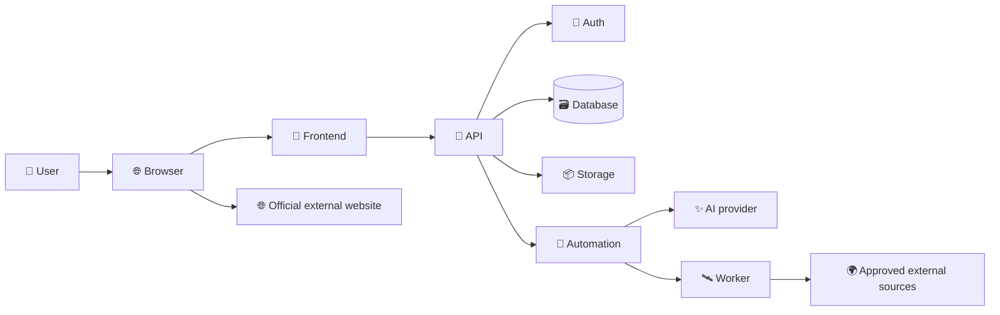

# Master prompt: complete README and beginner guide for any project

Act as a senior software architect, full-stack developer, technical writer, open-source maintainer, recruiter-focused documentation specialist and beginner educator.

I will give you a completed software project. Inspect the actual local code and the actual GitHub repository. Understand how it works. Then create or improve two permanent documentation files:

1. The root `README.md`.
2. A detailed `docs/BEGINNER-GUIDE.md`.

The documentation must be accurate, colorful, easy to scan, deeply explanatory and understandable to a beginner. Never invent a feature, API, database table, automation step, integration, test result, deployment behavior or security control. Use the repository as the source of truth.

## Audit first

Inspect frontend, backend, APIs, components, routes, hooks, database schema and migrations, authentication, authorization, storage, workers, automation workflows, AI integrations, external APIs, file parsing, document export, validation, error handling, loading states, empty states, environment examples, package files, build scripts, tests, CI/CD, deployment configuration, existing documentation, prompts and generated assets.

Compare local and GitHub: branch, commit hashes, uncommitted files, missing files and outdated documentation. Do not claim parity until the hashes match.

## Root README

Write a polished README with a project title, one-sentence value proposition, status, live URL, repository URL, accurate badges, emojis and a prominent beginner-guide link. Explain:

- What the project is
- Who uses it
- Why it was built
- The problem it solves
- What it does not do
- One practical example from first user action to final result

Add colorful feature cards and explain every implemented feature. For each feature describe what the user does, what the frontend does, the API request, validation, database effects, external service effects, success result, failure result and implementation files.

Cover all real features, including authentication, profiles, uploads, PDF/Word parsing, autofill, search, filters, matching, normalization, deduplication, saved records, deletion, research, AI writing, prompts, validation, exports, status tracking, notes, backup, restore, workers, external website handoff, loading states, empty states and errors.

## 3D architecture

Create or update `docs/architecture-3d.svg`. It must be full color, isometric or 3D-looking, readable, accessible, GitHub-compatible and repository-owned. Show the user, browser, frontend, deployment platform, API, authentication, database, storage, worker, automation platform, AI provider and external APIs or websites. Add a title and description to the SVG. Embed it in both README files.

Also include a Mermaid flow such as:



Explain every arrow in simple English.

## Technology explanation

Create a table with technology, beginner explanation, reason for using it and implementation location. Include every real language, framework, build tool, runtime, API framework, database, authentication provider, storage provider, automation platform, AI provider, parser, exporter, test tool, deployment platform, CI/CD tool, monitoring tool and external API.

## APIs and database

Document every important API route with method, path, purpose, authentication, request, response, success example, error example, database effects, external calls, security checks and source file.

Explain every database table, important columns, relationships, ownership model, indexes, Row Level Security, private/public data, insert/update/delete flow, migrations, backup and restore. Explain authentication, sessions, confirmation, sign-out and protected routes. Never document real credentials.

## Automation and Make

Explain deeply why automation exists, what would happen without it, why the selected platform is useful, what it does and what it does not do. Describe every real scenario:

- Name and purpose
- Trigger and schedule
- Every module in order
- Input JSON
- Field mappings
- Filters and conditions
- External connections
- Database effects
- Output JSON
- Error path
- Retry behavior
- Execution history
- Activation and pause behavior
- Required environment variables
- Manual test steps
- Troubleshooting

For a scheduled worker explain: scheduler starts, HTTP request is sent, private key is checked, worker calls approved sources, records are normalized, database is updated, response is returned and Make records success or failure.

For an AI webhook explain: user clicks, frontend gathers context, API sends JSON, Make receives it, fields are mapped to the AI provider, structured output returns, Make maps the response, the app validates it and the user reviews and saves it.

Use this simple explanation when accurate: “The automation platform is the messenger and clock. It moves information between services and starts repeated work. It is not the database and it is not the source of truth.”

Never include private webhook URLs, API keys, worker keys or passwords.

## AI, uploads and documents

Explain the model provider, model, supplied context, excluded context, prompt assembly, master prompt preservation, resume and cover-letter differences, JSON contract, validation, placeholder handling, hallucination prevention, usage limits, fallbacks and human review. Never promise perfect ATS results or job outcomes.

Explain accepted file types, size limits, MIME checks, PDF parsing, Word parsing, text parsing, archive protection, missing fields, autofill suggestions, confirmation, DOCX generation, Markdown generation, PDF printing, page breaks and formatting rules.

## External websites, security and privacy

For each external website state whether the URL is official, whether credentials or cookies are stored, whether scraping or browser automation occurs, whether final actions are user-controlled and what is intentionally unsupported.

Document secrets management, environment variables, authentication, authorization, RLS, private storage, URL validation, SSRF protection, upload limits, input/output validation, XSS protection, rate limits, logging, safe errors, backups and deletion.

## Beginner guide

Create `docs/BEGINNER-GUIDE.md`, substantially longer than the root README. Start with “Read this first” and explain the whole project in plain words using a real example. Use emojis such as 🌟 🧰 🔐 👤 📄 🔎 💾 🔁 ✨ ✅ 📦 🚀 🧯.

For every major workflow use these headings:

### What the user does
### What the frontend does
### What the API does
### What the database does
### What external services do
### What the user sees next
### Why this design was chosen

Cover setup, authentication, profile, uploads, parsing, autofill, search, discovery, matching, deduplication, saved records, deletion, research, tailored documents, prompts, Make scenarios, AI mapping, validation, export, API requests, database records, security, deployment, tests, troubleshooting, limitations, extension and production readiness.

Explain Make in the deepest detail: its purpose, the alternative without it, scheduling, webhooks, mappings, worker calls, AI calls, response handling, errors, execution history, activation, secrets and verification.

## Folder READMEs

Add or update a README in each important folder, at minimum:

- `client/README.md`
- `api/README.md`
- `lib/README.md`
- `supabase/README.md`
- `scripts/README.md`
- `tests/README.md`
- `docs/README.md`
- `dist/README.md`

Each must explain purpose, important files, connections, beginner starting point, safe changes, tests and related documentation. Do not create files inside dependency folders.

## Local setup and deployment

Provide exact commands for the real project, usually:

```bash
npm ci
npm run build
npm run check
npm test
npm start
```

Explain required software, environment variables, database setup, authentication, storage, automation, AI, seed data, logs and reset steps. Explain GitHub branch, build command, output directory, hosting, secrets, redirects, domains, automatic deployment, rollback and post-deployment verification.

## Verification

Before committing:

1. Check every relative link and linked file.
2. Validate the SVG and README embeds.
3. Search for secrets, passwords, private URLs and outdated names.
4. Search for fictional features and contradictions.
5. Run syntax checks, tests, production build and `git diff --check`.
6. Check Git status.
7. Compare local `HEAD` with GitHub.
8. Commit and push.
9. Confirm local and remote hashes match.
10. Decide whether a deployment is needed. Do not redeploy for documentation-only changes unless required.

## Final response

Report the files changed, links to README, beginner guide and architecture, folder guides, tests, build result, commit hash, push result, local/remote parity, deployment requirement and remaining limitations. Be honest and never claim production readiness without evidence.

## Project context

Project name: [PROJECT NAME]

Purpose: [PROJECT PURPOSE]

GitHub: [GITHUB URL]

Live deployment: [DEPLOYMENT URL]

Frontend: [FRONTEND]

Backend: [BACKEND]

Database: [DATABASE]

Authentication: [AUTH]

Automation: [AUTOMATION]

AI provider: [AI PROVIDER]

Deployment: [DEPLOYMENT PLATFORM]

Important limitations: [LIMITATIONS]

Now inspect the repository and complete all documentation work. Do not stop at a short summary. Explain the implementation from beginning to end in simple language so a beginner has no confusion.
